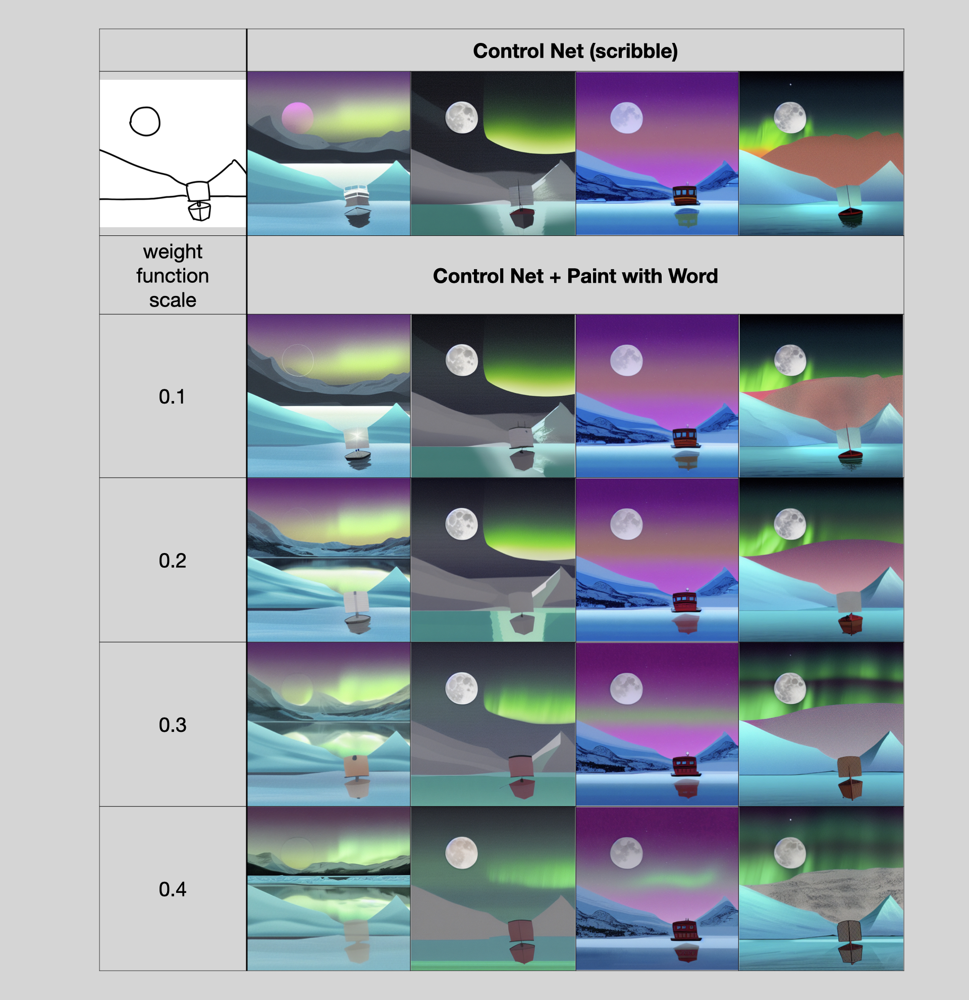
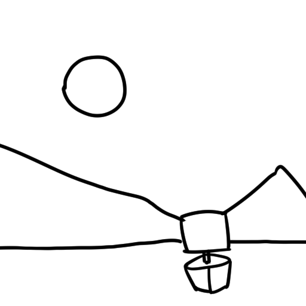
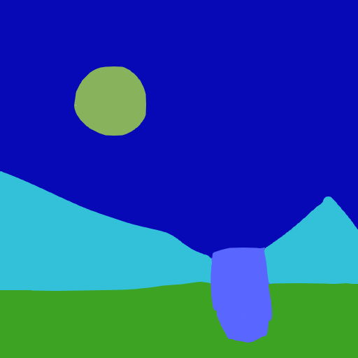
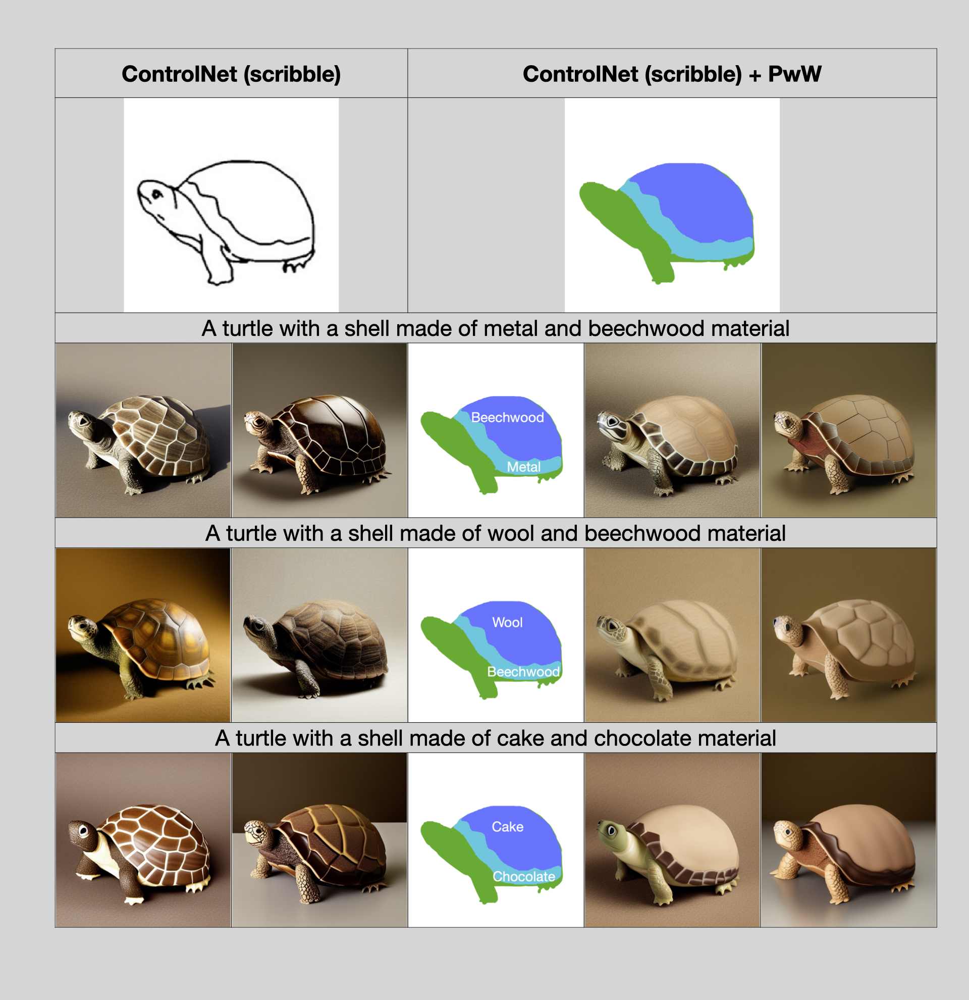
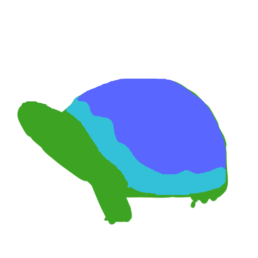

# AUTOMATIC1111 stable-diffusion webui extension combining [Paint-with-Word (PwW)](https://github.com/cloneofsimo/paint-with-words-sd) and [ControlNet](https://github.com/Mikubill/sd-webui-controlnet).


## Installation

#### (1) Clone the source code to A1111 webui extensions
one can install by cloning the 'pww_controlnet" directory into the extensions directory of A1111 webui

```bash
cd path/stable-diffusion-webui/extensions/
git clone git@github.com:lwchen6309/sd-webui-controlnet-pww.git
```

where path is the location of A1111 webui.

The webui should be like

if it is successfully installed.

### (2) Setup pretrained model of ControlNet
Please follow the instruction of [controlnet extension](https://github.com/Mikubill/sd-webui-controlnet) to get the pretrained models. 

## Preparing color content

Similar to the ui of PwW, one can prepare the color content by first clicking "Extract color content" then "Generate olor content"


In this extension, the regional-based seeding is not enables, thus the random seed for each object will not be retrieved (just leave it as -1).
More importantly, please DO NOT use "," in object as it would raise error for current implementation. Besides, please leave object as "" if no object is assigned for the region.

## Benchmark of ControlNet + PwW

The following figure shows the comparison between the ControlNet results and the ControlNet+PwW results for the boat examples. 

<!-- #region -->
<p align="center">

</p>
<!-- #endregion -->

Noting that the PwW make the background, e.g. aurora and mountains, more realistic as weight function scales increases. 

The setups are detailed as follows

Scribble and Segmentation map:

<p float="middle">
  
   
</p>

Prompts:

> "A digital painting of a half-frozen lake near mountains under a full moon and aurora. A boat is in the middle of the lake. Highly detailed."

Color contents: 

> "{(7, 9, 182): "aurora,0.5,-1",(136, 178, 92): "full moon,1.5,-1",(51, 193, 217): "mountains,0.4,-1",(61, 163, 35): "a half-frozen lake,0.3,-1",(89, 102, 255): "boat,2.0,-1",}"

## Assign the material for the specific region in scribble

One can use PwW to assign the material upon scribble, see the results comparing ControlNet and ControlNet+PwW below.

<!-- #region -->
<p align="center">

</p>
<!-- #endregion -->

Noting that the material of turtle shell specified by PwW is significantly improved showns in the right blocks.

The setups are detailed as follows:

Scribble and Segmentation map:

<p float="middle">
  
   
</p>

Note that there are additional prompt: "its texture and grain need to be particularly emphasized." for these examples. Making the full prompts and color content shown as follows for the 3 cases respectively.

Prompts:

> "A turtle with a shell made of metal and beechwood material, its texture and grain need to be particularly emphasized."

> "A turtle with a shell made of wool and beechwood material, its texture and grain need to be particularly emphasized."

> "A turtle with a shell made of cake and chocolate material, its texture and grain need to be particularly emphasized."

Color contents: 

>"{(255, 255, 255):",0.5,-1",(89, 102, 255):"beechwood,2.0,-1",(61, 163, 35):"turtle,1.5,-1",(51, 193, 217):"metal,1.0,-1"}"

> "{(255, 255, 255):",0.5,-1",(89, 102, 255):"wool,2.0,-1",(61, 163, 35):"turtle,1.5,-1",(51, 193, 217):"beechwood,1.0,-1"}"

> "{(255, 255, 255):",0.5,-1",(89, 102, 255):"cake,2.0,-1",(61, 163, 35):"turtle,1.5,-1",(51, 193, 217):"chocolate,1.0,-1"}"

with random seed: 0, and weight function scale: 0.3


---

## sd-webui-controlnet
(WIP) WebUI extension for ControlNet and T2I-Adapter

This extension is for AUTOMATIC1111's [Stable Diffusion web UI](https://github.com/AUTOMATIC1111/stable-diffusion-webui), allows the Web UI to add [ControlNet](https://github.com/lllyasviel/ControlNet) to the original Stable Diffusion model to generate images. The addition is on-the-fly, the merging is not required.

ControlNet is a neural network structure to control diffusion models by adding extra conditions. 

Thanks & Inspired: kohya-ss/sd-webui-additional-networks

### Limits

* Dragging large file on the Web UI may freeze the entire page. It is better to use the upload file option instead.
* Just like WebUI's [hijack](https://github.com/AUTOMATIC1111/stable-diffusion-webui/blob/3715ece0adce7bf7c5e9c5ab3710b2fdc3848f39/modules/sd_hijack_unet.py#L27), we used some interpolate to accept arbitrary size configure (see `scripts/cldm.py`)

### Install

1. Open "Extensions" tab.
2. Open "Install from URL" tab in the tab.
3. Enter URL of this repo to "URL for extension's git repository".
4. Press "Install" button.
5. Reload/Restart Web UI.

Upgrade gradio if any ui issues occured: `pip install gradio==3.16.2`

### Usage

1. Put the ControlNet models (`.pt`, `.pth`, `.ckpt` or `.safetensors`) inside the `models/ControlNet` folder.
2. Open "txt2img" or "img2img" tab, write your prompts.
3. Press "Refresh models" and select the model you want to use. (If nothing appears, try reload/restart the webui)
4. Upload your image and select preprocessor, done.

Currently it supports both full models and trimmed models. Use `extract_controlnet.py` to extract controlnet from original `.pth` file.

Pretrained Models: https://huggingface.co/lllyasviel/ControlNet/tree/main/models

### Extraction

Two methods can be used to reduce the model's filesize:

1. Directly extract controlnet from original .pth file using `extract_controlnet.py`.

2. Transfer control from original checkpoint by making difference using `extract_controlnet_diff.py`.

All type of models can be correctly recognized and loaded. The results of different extraction methods are discussed in https://github.com/lllyasviel/ControlNet/discussions/12 and https://github.com/Mikubill/sd-webui-controlnet/issues/73. 

Pre-extracted model: https://huggingface.co/webui/ControlNet-modules-safetensors

Pre-extracted difference model: https://huggingface.co/kohya-ss/ControlNet-diff-modules

### Tips 

* Don't forget to add some negative prompt, default negative prompt in ControlNet repo is "longbody, lowres, bad anatomy, bad hands, missing fingers, extra digit, fewer digits, cropped, worst quality, low quality".
* Regarding canvas height/width: they are designed for canvas generation. If you want to upload images directly, you can safely ignore them.

### Examples

| Source | Input | Output |
|:-------------------------:|:-------------------------:|:-------------------------:|
| (no preprocessor) |   |  |
| (no preprocessor) |   |  |
|  |   |  |
|  |   |  |
|  |   |  |
|  |   |  |
|  |   |  |

### T2I-Adapter Support

(From TencentARC/T2I-Adapter)

T2I-Adapter is a small network that can provide additional guidance for pre-trained text-to-image models. 

To use T2I-Adapter models:
1. Download files from https://huggingface.co/TencentARC/T2I-Adapter
2. Copy corresponding config file and rename it to the same name as the model - see list below.
3. It's better to use a slightly lower strength (t) when generating images with sketch model, such as 0.6-0.8. (ref: [ldm/models/diffusion/plms.py](https://github.com/TencentARC/T2I-Adapter/blob/5f41a0e38fc6eac90d04bc4cede85a2bc4570653/ldm/models/diffusion/plms.py#L158))

| Adapter | Config |
|:-------------------------:|:-------------------------:|
| t2iadapter_canny_sd14v1.pth | sketch_adapter_v14.yaml |
| t2iadapter_sketch_sd14v1.pth | sketch_adapter_v14.yaml |
| t2iadapter_seg_sd14v1.pth | image_adapter_v14.yaml |
| t2iadapter_keypose_sd14v1.pth | image_adapter_v14.yaml |
| t2iadapter_openpose_sd14v1.pth | image_adapter_v14.yaml |
| t2iadapter_color_sd14v1.pth | t2iadapter_color_sd14v1.yaml |
| t2iadapter_style_sd14v1.pth | t2iadapter_style_sd14v1.yaml |

Note: 

* This implement is experimental, result may differ from original repo.
* Some adapters may have mapping deviations (see issue https://github.com/lllyasviel/ControlNet/issues/255)

### Adapter Examples

| Source | Input | Output |
|:-------------------------:|:-------------------------:|:-------------------------:|
| (no preprocessor) |  |  |
| (no preprocessor) |  |  |
| (no preprocessor) |  |  |
| (no preprocessor) |  |  |
|  |  |  |
|  | (clip, non-image) |  |

Examples by catboxanon, no tweaking or cherrypicking. (Color Guidance)

| Image | Disabled | Enabled |
|:-------------------------:|:-------------------------:|:-------------------------:|
|  |   |  |
|  |   |  |

### Minimum Requirements

* (Windows) (NVIDIA: Ampere) 4gb - with `--xformers` enabled, and `Low VRAM` mode ticked in the UI, goes up to 768x832

### CFG Based ControlNet (Experimental)

The original ControlNet applies control to both conditional (cond) and unconditional (uncond) parts. Enabling this option will make the control only apply to the cond part. Some experiments indicate that this approach improves image quality.

To enable this option, tick `Enable CFG-Based guidance for ControlNet` in the settings.

Note that you need to use a low cfg scale/guidance scale (such as 3-5) and proper weight tuning to get good result.

### Guess Mode (Non-Prompt Mode, Experimental)

Guess Mode is CFG Based ControlNet + Exponential decay in weighting. 

See issue https://github.com/Mikubill/sd-webui-controlnet/issues/236 for more details.

Original introduction from controlnet:

The "guess mode" (or called non-prompt mode) will completely unleash all the power of the very powerful ControlNet encoder.

In this mode, you can just remove all prompts, and then the ControlNet encoder will recognize the content of the input control map, like depth map, edge map, scribbles, etc.

This mode is very suitable for comparing different methods to control stable diffusion because the non-prompted generating task is significantly more difficult than prompted task. In this mode, different methods' performance will be very salient.

For this mode, we recommend to **use 50 steps and guidance scale between 3 and 5.**

### Multi-ControlNet / Joint Conditioning (Experimental)

This option allows multiple ControlNet inputs for a single generation. To enable this option, change `Multi ControlNet: Max models amount (requires restart)` in the settings. Note that you will need to restart the WebUI for changes to take effect.

* Guess Mode will apply to all ControlNet if any of them are enabled.

| Source A | Source B | Output |
|:-------------------------:|:-------------------------:|:-------------------------:|
|  |   |  |

### Weight and Guidance Strength/Start/End

Weight is the weight of the controlnet "influence". It's analogous to prompt attention/emphasis. E.g. (myprompt: 1.2). Technically, it's the factor by which to multiply the ControlNet outputs before merging them with original SD Unet.

Guidance Start/End is the percentage of total steps the controlnet applies (guidance strength = guidance end). It's analogous to prompt editing/shifting. E.g. \[myprompt::0.8\] (It applies from the beginning until 80% of total steps)

### API/Script Access

This extension can accept txt2img or img2img tasks via API or external extension call. Note that you may need to enable `Allow other scripts to control this extension` in settings for external calls.

To use the API: start WebUI with argument `--api` and go to `http://webui-address/docs` for documents or checkout [examples](https://github.com/Mikubill/sd-webui-controlnet/blob/main/example/api_txt2img.ipynb).

To use external call: Checkout [Wiki](https://github.com/Mikubill/sd-webui-controlnet/wiki/API)

### MacOS Support

Tested with pytorch nightly: https://github.com/Mikubill/sd-webui-controlnet/pull/143#issuecomment-1435058285

To use this extension with mps and normal pytorch, currently you may need to start WebUI with `--no-half`.

### Example: Visual-ChatGPT (by API)

Quick start:

```base
# Run WebUI in API mode
python launch.py --api --xformers

# Install/Upgrade transformers
pip install -U transformers

# Install deps
pip install langchain==0.0.101 openai 

# Run exmaple
python example/chatgpt.py
```
